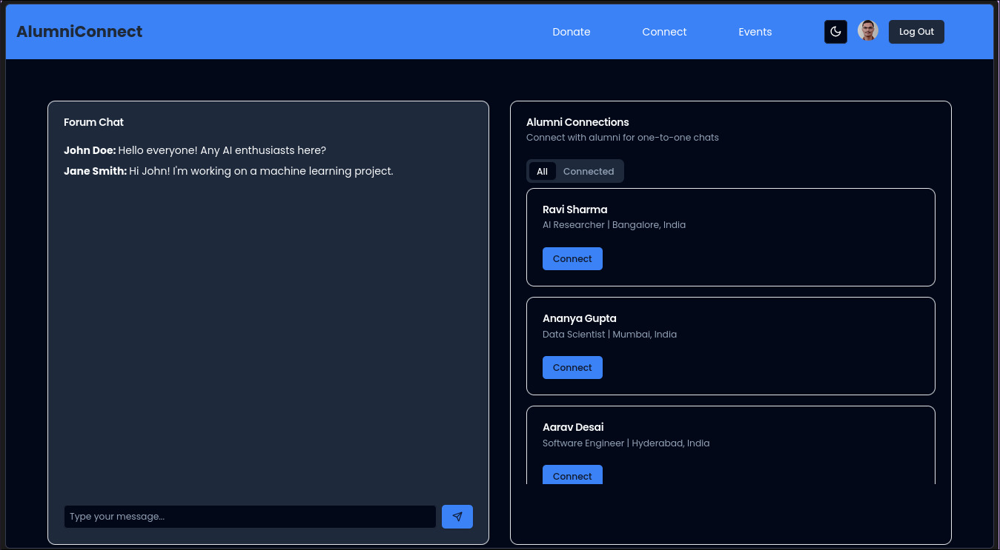

# AlumniConnect


## Table of Contents

- [Introduction](#introduction)
- [Features](#features)
- [Technologies Used](#technologies-used)
- [Installation](#installation)
- [Usage](#usage)
- [Screenshots](#screenshots)
- [Collaborators](#collaborators)
- [License](#license)

## Introduction

**AlumniConnect** is a comprehensive platform designed to strengthen the bonds between college alumni and their alma mater. By centralizing alumni activities, the platform facilitates engagement, donations, mentorship, networking, and event organization. Available as both a responsive website and a dedicated Android app, AlumniConnect ensures seamless interaction and support for the college community.

## Features

- **Secure Donation System:** Easily contribute to college projects and initiatives using Stripe integration.
- **Mentorship Tools:** Connect alumni with students based on industry, location, and interests to foster professional growth.
- **Searchable Alumni Directory:** Find and connect with alumni based on graduation year, profession, geographic location, and more.
- **Event Management:** Organize and participate in alumni events, reunions, and workshops to enhance community engagement.
- **LinkedIn Authentication:** Secure login and registration using Okta's LinkedIn authentication provider.

## Technologies Used

### Web Application

- **React:** A JavaScript library for building user interfaces.
- **Three.js:** A 3D library that makes WebGL simpler.
- **Okta Auth Provider:** For secure LinkedIn authentication.
- **Stripe:** Integrated for handling donations securely.

### Android Application

- **Jetpack Compose:** Android’s modern toolkit for building native UI.

## Installation

### Prerequisites

- **Node.js** and **npm** for the web application.
- **Android Studio** for the mobile application.

### Web Application

1. **Clone the Repository:**

   ```bash
   git clone https://github.com/yourusername/AlumniConnect.git
   cd AlumniConnect

2. Cd into the frontend directory and install the dependencies:

   ```bash
   cd frontend
   npm install
   ```
3. Cd into the backend directory and install the dependencies:

   ```bash
   cd ../backend
   # make sure you have env activated if you system requires it
   # you can create a virtual environment with `python3 -m venv env`
   # use can activate it with `source env/bin/activate`
   pip install -r requirements.txt
   ```

4. Create a `.env` file in the frontend directory and add the backend URL:

    ```bash
    echo VITE_API_URL=http://localhost:8000 >> ../frontend/.env
    ```

5. Start the frontend development server and backend server:

    ```bash
    npm run dev
    ```
    In another terminal, start the backend server:
    ```bash
    python manage.py runserver
    ```

### Android Application

Open in Android Studio:

- Launch Android Studio.
- Click on File > Open and navigate to the app directory within the project.

Build and Run:

- Connect an Android device or start an emulator.
- Click the Run button to build and deploy the app.

## Usage

- Register/Login: Use your LinkedIn account to authenticate via Okta.
- Donate: Navigate to the donation section and contribute securely using Stripe.
- Connect: Browse the alumni directory to find and connect with peers.
- Mentor: Offer or seek mentorship opportunities tailored to your industry and interests.
- Events: View upcoming events or create new ones to engage with the community.

## Screenshots

### Web Application





### Android Application


## Collaborators

- [@Pratyay Koley](https://github.com/PratyayKoley)
- [@Ronit Naik](https://github.com/RonitNaik122)
- [@Badal Singh](https://github.com/BadalSingh2)

## License

This project is licensed under the MIT License - see the [LICENSE](LICENSE) file for details.
